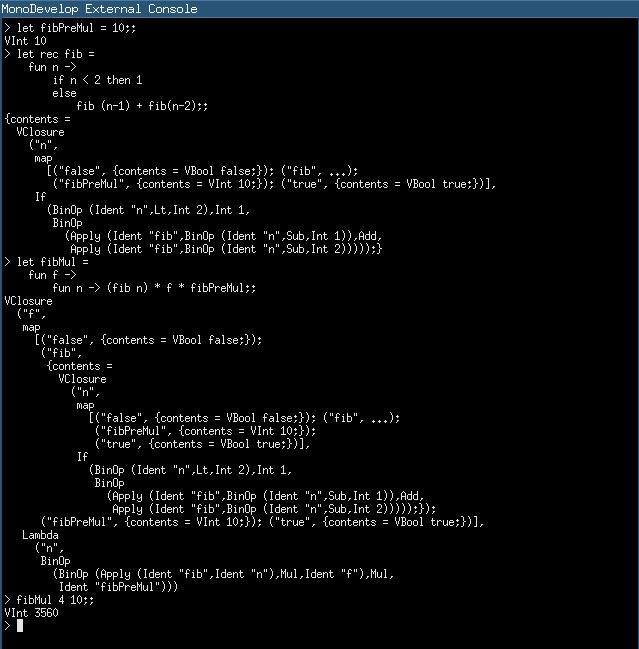

Dieses Tutorial führt den Leser Schritt für Schritt durch die Erstellung eines simplen Terminal-REPLs^[Read Eval Print Loop] für eine kleine Teilmenge der funktionalien Sprache ML unter Verwendung der Parser-Kombinator Bibliothek FParsec^[http://www.quanttec.com/fparsec/].

# FemptoML

FemptoML ist eine erfundene Sprache. Sie enthält folgende Konstrukte:

* (Rekursive) Let-Statements
* (Rekursive) Let-Expressions
* Lambda-Expressions (Funktionen)
* Integers
* Die Operatoren > < und = sowie + - * und /

Das Ziel ist es, folgendes ziemlich sinnloses Programm laufen lassen zu können:

```fs
let fibPreMul = 10;;

let rec fib =
    fun n ->
        if n < 2 then 1
        else
            fib (n-1) + fib(n-2);;

let fibMul =
    fun f ->
        fun n -> (fib n) * f * fibPreMul;;

fibMul 4 10;;
```

Es beinhaltet beinahe alle Sprachkonstrukte, die in FemtoML unterstützt werden sollen.

Das Resultat der Ausführung ist 3560. Es setzt sich zusammen aus Fibonacci von 10 multipliziert mit 40 (4 * 10).

## Syntax

Wir implementieren folgende Syntax^[https://en.wikipedia.org/wiki/Wirth_syntax_notation]. Benötigter und optionaler Whitespace ist nicht dargestellt. Dieser würde die Darstellung etwas unübersichtlich machen.

```javascript
DIGIT = "0" | "1" | "2" | "3" | "4" | "5" | "6" | "7" | "8" | "9"
LETTER = "a" | "b" | ... | "z" | "A" | "B" | ... | "Z"
ALPHANUM = ( DIGIT | LETTER ) .
LET-STATEMENT = "let" { "rec" } IDENTIFIER "=" EXPRESSION
EXPRESSION = {
    FUNCTION |
    LET-EXPRESSION |
    INTEGER |
    FUNCTION-APPLICATION |
    BINARY-OPERATOR |
    IF-THEN-ELSE
}
FUNCTION = "fun" IDENTIFIER "->" EXPRESSION
LET-EXPRESSION = "let" { "rec" } IDENTIFIER "=" EXPRESSION "in" EXPRESSION
INTEGER = DIGIT { INTEGER | "" }
IDENTIFIER = LETTER { ALPHANUM . }
FUNCTION-APPLICATION = IDENTIFIER { INTEGER | "(" EXPRESSION ")" }
BINARY-OPERATOR =
    EXPRESSION
    "<" | "=" | ">" | "+" | "-" | "*" | "/"
    EXPRESSION
IF-THEN-ELSE = "if" EXPRESSION "then" EXPRESSION "else" EXPRESSION
STATEMENT = { LET-STATEMENT | EXPRESSION } ";;"
```

# Implementation

## Aufbau

Das Ausführen eines Stück Codes läuft immer gleich ab:

* Einlesen einer Zeichenkette bis zum Doppel-Semikolon ";;"
* Parsen der Zeichenkette und Bildung eines AST^[Abstract Syntax Tree] in Form eines Expression-Typs
* Evaluieren (ausführen) des AST
* Ausgeben des Resultats

Dafür brauchen wir drei Komponenten:

* Einen Terminal-Cleint, der User-Input vom **Terminal liest** und an den **Parser** weiterleitet
* Einen Parser, der einen String als Input nimmt und einen **AST** vom Typ **`Expr`** zurückgibt
* Eine **eval** Funktion, die den AST als Input nimmt und einen Wert vom Typ **`Value`** zurückgibt

## Vorbereitung

Das Tutorial geht davon aus, dass F# installiert und entweder mit Xamarin-Studio, MonoDevelop oder VisualStudio entwickelt wird. Ausserdem muss bereits ein Projekt z.B. mit dem Namen FemtoML erstellt worden sein.

Für das Parsing benötigen wir die FParsec^[http://www.quanttec.com/fparsec/]  Bibliothek. Am einfachsten wird diese über NuGet^[https://www.nuget.org/] installiert.

Für alle genannten Entwicklungsumgebungen existiert ein NuGet-AddIn, das zuerst noch installiert werden muss. Die Installation wird dem Leser überlassen.

Mit Hilfe des Plugins kann danach FParsec installiert werden. Das Tutorial geht davon aus, dass auch FParsec installiert und in der Solution eingebunden wurde.

Für die Entwicklung brauchen wir zwei Module: System und FParsec. Diese müssen importiert werden. Dafür bitte:

```fs
open System
open FParsec
```

zuoberst in **Program.fs** (bzw. in die Main-Datei des Projekts) einfügen.

## Kurze Einführung in FParsec

FParsec ist eine Parser-Kombinator Library. Parser-Kombinatoren erlauben das Erstellen von Parsern aus mehreren Teilparsern. Einen sehr guten Einstieg in das Thema gibt das Tutorial^[http://www.quanttec.com/fparsec/tutorial.html], das direkt auf der Website von FParsec zu finden ist. Hier trotzdem ein kurzer Abriss.

Parser haben die Form

```fs
type Parser<'Result,'UserState> = 
    CharStream<'UserState> -> Reply<'Result>
```

Der Parser ist demnach etwas, das einen Stream von Chars aufnimmt und eine Anwort mit einem Resultat produziert. Auf den `'UserState` wird in diesem Tutorial nicht eingegangen^[Informationen darüber können hier nachgelesen werden: http://www.quanttec.com/fparsec/users-guide/parsing-with-user-state.html]. 

Wichtig für uns ist, dass Parser typisiert sind. Das Resultat eines Parsers ist immer durch den Typ `'Result` gegeben.

z.B. bietet FParsec einen Parser an, um einen Float-Wert zu parsen. Dessen Result-Typ ist `float`.

```fs
val pfloat = Parser<float, 'u>
```

Wie sich der Typ auswirkt sehen wir, sobald wir den Parser auf einen Input anwenden. Dazu stehen eine Reihe von Funktionen zur Auswahl:

* `runParserOnString` 
* `runParserOnStream` 
* `runParserOnFile` 

oder einfach

* `run` 

welcher eine Abkürzung für `runParserOnString` ist. Wir verwenden diesen Runner und wenden den Parser `pfloat` auf den String "1.45" an.

```fs
match run pfloat "1.45" with
| Success(result, _, _)   -> printfn "Success: %A" result
| Failure(errorMsg, _, _) -> printfn "Failure: %s" errorMsg
```

Die Ausgabe davon ist "Success: 1.45" und der Typ von `result` ist `float`.

Wie wir auch später noch sehen werden, können Parser kombiniert werden. 

```fs
pfloat .>>. pstring " " .>>. pstring "foobar"
```

Das Resultat einer Kombination ist immer wieder ein Parser. `.>>.` ist ein Kombinator (kein Parser), der von FParsec zur Verfügung gestellt wird. Er nimmt zwei Parser p1 und p2 als Parameter und gibt einen neuen Parser zurück, der zuerst p1 und danach p2 ausführt, die Resultate speichert und als Tupel zurückgibt.

Der Typ von `pfloat .>>. pstring " "` ist demnach `Parser<(float * string) * string, 'UserState>`. Im Laufe dieses Tutorials lernen wir noch weitere Kombinatoren kennen.

Ein weiterer wichtiger Aspekt des Parsens ist, dass gewisse Parser Zeichen **konsumieren** und andere nicht.

`pfloat` und `pstring string` konsumieren die Zeichen, die sie lesen. So bekam der Parser `pstring "foobar"` als Input nur noch den Teil des Strings, der von den vorheringen Parsern noch nicht gelesen wurde, also "foobar". Manchmal ist es aber nötig, dass ein Parser die Zeichen nicht konsumiert. z.B. konsumiert `pstring` alle Zeichen, falls er erfolgreich ist, falls nicht, konsumiert er keine Zeichen. 

Deshalb sind folgende Parser unterschiedlich:

```fs
let ab1 = pstring "ab"
let ab2 = pstring "a" .>>. pstring "b"

// bzw.
let ac1 = pstring "ac"
let ac2 = pstring "a" .>>. pstring "c"
```

Unter Verwendung des Kombinators `p1 <|> p2` lässt sich ein Parser erstellen, der zuerst `p1` anwendet und falls dieser nicht erfolgreich ist, mit `p2` weiterfährt. Damit können wir z.B. folgenden Parser bauen:

```fs
let p = ab1 <|> ac1
```

Angewendet auf den String `"ac"` gibt dieser Parser erfolgreich "ac" zurück. Wenn wir das gleiche jedoch mit `ab2` und `ac2` versuchen:

```fs
let p = ab2 <|> ac2
```

schlägt die Anwendung auf "ac" fehl. Das Problem ist, dass `pstring "a"` vom `ab2` Parser erfolgreich war und das Zeichen "a" konsumiert hat. Da kein "b" folgt, wird ein Fehler produziert. Der Parser, der mit dem `<|>` Kombinator erstellt wurde, führt nun `ac2` aus. Dieser produziert einen Fehler, weil er als ersten String ein "a" erwartet, dies jedoch bereits konsumiert wurde und er ein "c" liest.

Um dies zu korrigieren gibt es z.B. den `attempt p1` Kombinator. Die `attempt` Funktion nimmt einen Parser und gibt einen Parser zurück. Falls nun ein Fehler beim Ausführen von p1 auftritt, wird die Position im Stream auf jene zurückgesetzt, die vor der Ausführung von `p1` gesetzt war. Damit können wir den Parser umschreiben auf 

```fs
let p = (attempt ab2) <|> ac2
```

Dieser Parser kann nun den String "ac" erfolgreich parsen.


## Eine Anmerkung zu den Code-Beispielen

Damit das Tutorial so gut wie möglich nachvollzogen werden kann, ist der gesamte Code eingebettet und wird jeweils kommentiert. Der Code kann 1:1 aus dem Tutorial übernommen werden, auch die Einrückung stimmt jeweils. Falls Code nicht übernommen werden soll, wie es z.B. beim Listing von Funktions-Signaturen vorkommt, ist die Syntax *nicht* eingefärbt. F#-Code, der eingefärbt ist, kann übernommen werden, nicht eingefärbter Code nicht.

## Der Parser

Der Parser ist verantwortlich für die Umwandlung einer Zeichenkette in einen AST. Den AST definieren wir selbst.

Zuerst definieren wir die unterstützten binären Operatoren, wie wir sie spezifiziert haben. Damit wollen wir z.B. `VARIABLE > 2` abbilden, aber auch `1 + 3`.

```fs
type BinOp =
    | Eq
    | Lt
    | Gt
    | Add
    | Sub
    | Mul
    | Div
```

Die Expression selbst kann folgendermassen ausgedrückt werden:

```fs
type Expr =
    | Int of int
    | Ident of string
    | BinOp of Expr * BinOp * Expr
    | Apply of Expr * Expr
    | If of Expr * Expr * Expr
    | Lambda of string * Expr
    | Let of bool * string * Expr * Expr
    | LetStmt of bool * string * Expr
```

Damit unterstützen wir Integers (Int), Identifikatoren wie Variablen, Funktionsnamen oder Funktionsargumente (Ident), Binäre Operatoren (BinOp), Anwendungen von Funktionen (Apply), If-Then-Else Ausdrücke (If), Funktionen (Lambda), Let-Expressions (Let) und Let-Statements (LetStmt).

Der Unterschied zwischen Let-Expressions und -Statements ist, dass die Let-Expression evaluiert werden kann und somit einen Wert zurück gibt, das LetStmt jedoch nicht. Let-Statements werden nur benötigt, damit der REPL besser verwendet werden kann. Es erlaubt uns z.B., Funktionen im globalen Scope zu definieren und sie erst später auszuführen. Dieses Thema wird später erneut aufgegriffen und vertieft.

Um eine Zeichenkette in Expressions umzuwandeln, brauchen wir nun eine Vielzahl an Parsern.

FParsec bietet bereits einige Parser an, die man weiter kombinieren kann. Für Integers gibt es bereits den `punit32` Parser. Der `|>>` Kombinator erstellt einen Parser, dessen Resultat in eine Funktion piped, bevor es zurückgegeben wird. Der `spaces` Parser frisst den Whitespace nach dem Integer auf. Mit den Kombinatoren `.>>`, `>>.` sowie `.>>.` können mehrere Parser nacheinander ausgeführt werden. Der Punkt gibt jeweils den Parser an, dessen Resultat weiterverwendet werden soll.

* `p1 .>> p2` Es wird das Resultat von `p1` zurückgegeben
* `p1 >>. p2` Es wird das Resultat von `p2` zurückgegeben
* `p1 .>>. p2` Es wird wird ein Tupel mit den Resultaten von `p1` und `p2` zurückgegeben

Im Beispiel von `pInt` möchte man als Resultat des Parsers den Integer-Wert und nicht die optionalen Leerzeichen nach dem Integer. Darum wird `.>>` verwendet. Durch den `|>>` Operator wird das Resultat des `puint32` Parsers in die `int`-Funktion gepiped. Der Output dieses Parsers ist demnach vom Typ `int`, der Typ des `pInt`-Parsers `Parser<int, 'u>`.

```fs
let pInt = puint32 |>> int .>> spaces
```

Für das Parsen eines bestimmten Strings gibt es wir wissen den `pstring` Parser. Weil wir diesen Parser oft brauchen und ausserdem immer die Leerzeichen nach dem String ignorieren wollen, erstellen wir eine Abkürzung `str`. Diese kann z.B. benutzt werden, um mit `str "if"` einen Parser für den String "if", gefolgt von einer beliebigen Anzahl an Leerzeichen, zu erstellen. Der Output des Parsers ist der String ohne die Leerzeichen.

```fs
let str s = pstring s .>> spaces
```

Als nächstes brauchen wir einen Parser für Identifikatoren. Identifikatoren sind die Namen von Variablen, Funktionien und Funktionsargumenten. Sie müssen mit einem Buchstaben beginnen, gefolgt von einer beliebigen Kombination von Buchstaben und Zahlen.

Ein Identifikator darf kein Keyword sein. Darum erstellen wir zuerst eine Liste aller Keywords.

```fs
let keywords = ["if"; "then"; "else"; "let"; "rec"; "in"; "fun"]
```

Danach erstellen wir den Parser für Identifikatoren `pIdent`.

```fs
let pIdent =
```

Zuerst wird eine Funktion `isAlphaNum` definiert, welche für ein einzelnes Zeichen zurückgibt, ob es alphanumerisch ist oder nicht. Die Funktionen `isLetter` und `isDigit` werden von FParsec zur Verfügung gestellt.

```fs
    let isAlphaNum c = isLetter c || isDigit c
```

Danach wird die Funktion verwendet, um den `idStr` Parser zu erstellen, welcher einen ganzen Identifikator parsen kann. Dazu wird der `many1Satisfy2L`-Kombinator von FParsec verwendet. Seine Signatur ist (Code nicht übernehmen):

```
val many1Satisfy2: (char -> bool) -> (char -> bool)
    -> string -> Parser<string,'u>
```

Der Kombinator erwartet zwei Funktionen jeweils von char nach bool und zudem einen Fehler-Message und gibt einen entsprechenden Parser zurück. Die erste Funktion wird auf das erste Zeichen des Inputs angewendet, die zweite Funktion auf alle weiteren Zeichen. Falls die Funktionen true zurückgeben, ist der Parser erfolgreich, ansonsten nicht. Das letzte Argument ist der Fehler-Text, welche angezeigt wird, falls der Parser fehlschlägt.

In unserem Fall ist ein Identifkator eine Zahl/ein Buchstabe gefolgt von weiteren Zahlen oder Buchstaben. Falls der Parser fehlschlägt, wird die Meldung *Expecting: identifier* angezeigt.

```fs
    let idStr = many1Satisfy2L
                    isLetter
                    isAlphaNum
                    "identifier"
                    .>> spaces
```

Jetzt sollen noch alle Keywörter, aus der Menge der möglichen Identifikatoren entfernt werden. Dafür wird folgender Parser erstellt:

```fs
    let p state =
        let reply = idStr state
        if reply.Status = Ok
                && (List.exists ((=) reply.Result) keywords) then
            Reply(Error, expected "identifier")
        else
            reply
```

Der Parser `p` erhält einen State vom vorhergehenden Parser und wendet `idStr` auf ihn an. Falls ein Identifikator gefunden wurde (`reply.Status = Ok`), dieser jedoch ein reserviertes Keyword ist, wird ein Fehler zurückgegeben. Ansonsten, falls kein Identifikator wurde gefunden oder der gefundene ist kein Keyword, wird das ensprechende Resultat zurückgegeben.

```fs
    attempt p .>> spaces
```

Dieser erstellte Parser `p` wird dann zurückgegeben. Der `attempt`-Kombinator gibt einen Parser zurück, der sicherstellt, dass falls der `p`-Parser einen Fehler produziert, weil der Identifikator ein Keyword ist, die Position in der zu parsenden Zeichenkette wieder an die Position *vor* dem Identifikator gesetzt wird. Somit können nachfolgende Parser das Keyword erneut parsen. Ohne `attempt` könnten alle weiteren Parser die Zeichenkette erst ab der Position *nach* dem Identifikator weiterparsen.

```fs
let opp = OperatorPrecedenceParser<Expr, unit, unit>()
```

Um alle weiteren Expressions zu parsen, benutzen wir den `OperatorPrecedenceParser`. Dieser Parser unterstützt die Definition von verschiedenen Operatoren, einer Reihenfolge in der sie angewendet werden und einer Anzahl von Parsern für die Teile zwischen den Operatoren, die *Terme*.

```fs
let pExpr = opp.ExpressionParser .>> spaces
```

Über `opp.ExpressionParser` erhält man den Parser, der vom `opp` benutzt werden wird, um Expressions zu parsen. Damit kann bereits während der Definition des Parsers darauf Bezug genommen werden, bevor er fertig konfiguriert worden ist. Die Anwendung sehen wir direkt in den nächsten drei Code-Snippets.

Als erstes werden wir nun den Parser für die Terme zwischen den Operatoren definieren und ihn `opp.TermParser` zuweisen.

```fs
let pAtom =
    choice [
        pInt |>> Int
        pIdent |>> Ident
        between (str "(") (str ")") pExpr
    ]
```

Als Atome werden Integers, Identifikatoren und Expressions innerhalb von runden Klammern bezeichnet. `pAtom` parst diese Atome mit Hilfe des `choice`-Kombinators. Dieser nimmt eine Liste von Parsern, die nacheinander in der vorgegebenen Reihenfolge angewendet werden.

```fs
let pAtoms = many1 pAtom |>> fun fs ->
    List.reduce(fun f g -> Apply(f, g)) fs
```

Wenn mehrere Atome nacheinander vorkommen, werden sie von links nach rechts aufeinander angewendet. Das heisst dieser Parser auf "i1 i2 i3 i4" angewendet ergibt `Apply(Apply(Apply(Ident i1,Ident i2),Ident i3),Ident i4)`. Die Reihenfolge kann durch Klammerung beeinflusst werden. "i1 (i2 i3) i4" führt demnach zu `Apply(Apply(Ident i1, Apply(Ident i2,Ident i3)),i4)`.

Der Kombinator `many1` wird hier verwendet. Er produziert einen Parser, welcher den mitgegebenen Parser mehrmals und mindestens einmal anwendet. Der `many`-Kombinator kann verwendet werden, wenn der Parser auch null-mal angewendet werden kann. Über `|>>` wird der Output des Parsers in eine Funktion weitergeleitet, welche mittels List.reduce die Apply-Struktur erstellt. Falls die Liste nur ein Element enthält, wird dieses Element zurückgegeben.

```fs
let pIf =
    pipe3
        (str "if" >>. pExpr)
        (str "then" >>. pExpr)
        (str "else" >>. pExpr)
        (fun p t f -> If(p, t, f))
```

Zur Erstellung des Parsers für die If-Then-Else-Expression wird der `pipe3`-Kombinator verwendet. Es existieren `pipe2` bis `pipe5`. Die Nummern stehen für die Anzahl Parser, welche als Argumente mitgegeben werden können. Der Kombinator erstellt einen Parser, welcher die mitgegeben Parser in der angegeben Reihenfolge ausführt, die Outputs speichert und am Schluss als Argumente der Funktion übergibt, welche als letzer Parameter übergeben wurde. Falls mehr als fünf Parser benötigt werden, können entsprechende Funktionen einfach selbst erstellt werden.[^pipe7]

Falls die If-Then-Else-Expression erfolgreich geparst werden konnte, wird eine `If(condition, trueExpression, falseExpression)`-Expression erstellt.

[^pipe7]: Als Beispiel eine `pipe7` Funktion
    ```
    let pipe7 p1 p2 p3 p4 p5 p6 p7 f =
        pipe4 p1 p2 p3 (tuple4 p4 p5 p6 p7)
              (fun x1 x2 x3 (x4, x5, x6, x7) -> f x1 x2 x3 x4 x5 x6 x7)
    ```

Als nächstes erstellen wir den Parser für eine Let-Expression. Zur Erinnerung: Eine Let-Expression ist von der Form `let { rec } IDENTIFIER = EXPR1 in EXPR2`. Sie kann rekursiv sein und produziert in jedem Fall einen Wert und zwar der, welcher von EXPR2 produziert wird.

Der entsprechende Parser verwendet einen neuen Kombinator `opt` für das fakultative `rec`-Keyword. `opt` ist eine Abkürzung für `(p |>> Some) <|>% None`, `<|>%` ist wiederum eine Abkürzung für `p <|> preturn x` und `preturn x` ist ein Parser, der in jedem Fall `x` zurückgibt. Das heisst, `opt p` gibt `Some('t)` zurück wenn `p` erfolgreich ist, `None` falls nicht.

Nach erfolgreichem Parsen wird eine `Let(isRec, varName, expr1, expr2)`-Expression zurückgegeben.

```fs
let pLetExpr =
    pipe5
        ((str "let"))
        (opt (str "rec"))
        (pIdent .>> str "=")
        pExpr
        (str "in" >>. pExpr)
        (fun _ r var body rest ->
            let rBool =
                match r with
                | Some(_) -> true
                | None -> false
            Let(rBool, var, body, rest))
```

Die Letzte zu parsende Expression ist das Lambda. Dafür kommt nichts besonderes mehr hinzu.

```fs
let pLambdaExpr =
    pipe2
        (str "fun" >>. pIdent .>> str "->")
        pExpr
        (fun par body -> Lambda(par, body))
```

Alle erstellten Parser werden nun mit dem bereits kennen gelernten `choice`-Kombinator kombiniert. 

```fs
let term =
    choice [
        pAtoms
        pIf
        pLetExpr
        pLambdaExpr
    ]
```

Nun kann der Term-Parser dem `OperatorPrecedenceParser` mitgeteilt werden.

```fs
opp.TermParser <- term
```

Jetzt fehlen nur noch die Operatoren, um den Parser zu vervollständigen. Diese werden über die Funktion AddOperator hinzugefügt. Es gibt vier verschiedene Operatoren:

* InfixOperator für `TERM OPERATOR TERM` Konstrukte wie `x + y`
* PrefixOperator für `OPERATOR TERM` Konstrukte wie `++x`
* PostfixOperator für `TERM OPERATOR` Konstrukte wie `x--`
* TernaryOperator für ` TERM OPERATOR1 TERM OPERATOR2 TERM` Konstrukte wie das von C bekannte `x ? y : z`

Für FemtoML wird nur der `InfixOperator` benötigt.

Der Konstruktor des `InfixOperator` nimmt folgende Argumente:

* Der Operator-String
* Der Parser, der nach dem Operator angewendet werden soll
* Die Rangordnung (precedence). Je höher dieser Wert, desto höher die Rangordnung.
* Assoziativität (Keine, Links, Rechts)
* Mapping (Funktion, die den linken und rechten Term als Argumente bekommt)

Die Rangordnung zwischen den Operatoren ist folgende:

* `*` und `/`: Höchster Rang (Wert 100)
* `+` und `-`: Zweithöchster Rang (Wert 50)
* `>`, `=` und `<`: Tiefster Rang (Wert 1)

Das heisst `x + y * z > j` soll als `((x + (y * z)) > j)` gedeutet werden.

Die Assoziativität ist bei allen Operatoren `Associativity.Left` also von Links.

Das Hinzufügen der Operatoren ist dann relativ simpel:

```fs
opp.AddOperator(
    InfixOperator("=", spaces, 1, Associativity.Left,
                  fun f g -> BinOp(f, Eq, g)))

opp.AddOperator(
    InfixOperator("<", spaces, 1, Associativity.Left,
                  fun f g -> BinOp(f, Lt, g)))

opp.AddOperator(
    InfixOperator(">", spaces, 1,  Associativity.Left,
                  fun f g -> BinOp(f, Gt, g)))

opp.AddOperator(
    InfixOperator("+", spaces, 50, Associativity.Left,
                  fun f g -> BinOp(f, Add, g)))

opp.AddOperator(
    InfixOperator("-", spaces, 50, Associativity.Left,
                  fun f g -> BinOp(f, Sub, g)))

opp.AddOperator(
    InfixOperator("*", spaces, 100, Associativity.Left,
                  fun f g -> BinOp(f, Mul, g)))

opp.AddOperator(
    InfixOperator("/", spaces, 100, Associativity.Left,
                  fun f g -> BinOp(f, Div, g)))
```

Der Parser ist nun fast abgeschlossen. Jedoch haben wir bis jetzt nur die Möglichkeit, Expressions zu definieren, Statements fehlen noch. Expressions zeichnen sich dadurch aus, dass sie evaluiert werden und einen Wert produzieren. Das reicht aus, um ein Programm zu schreiben. Da wir aber einen Terminal-REPL bauen wollen, benötigen wir die Möglichkeit, Expressions Variabeln zuzuweisen, um sie später wieder zu verwenden.

Dazu wird neben der Let-Expression noch ein Let-Statement definiert. Das Let-Statement kann auch rekursiv sein, hat aber keine `in`-Expression.

```fs
let pLetStmt =
    pipe3
        (str "let" >>. opt (str "rec"))
        (pIdent .>> str "=")
        pExpr
        (fun r ident expr ->
            LetStmt(match r with
                    | Some(_) -> true
                    | None -> false
                    , ident, expr))
```

Zum Schluss werden `pExpr` und `pLetStmt` zu einem Parser zusammengefasst. Der `attempt`-
Kombinator wird benötigt. Ansonsten würde der `pExpr`-Parser das Statment `let x = 1`
anfangen zu parsen und fehlschlagen, weil nach der `1` kein `in`-Keyword folgt. Der Parser würde
dann mit einem Fehler beenden. Damit das nicht passiert, muss der Parser bei einem Fehler von
`pExpr` die Position in der Zeichenkette wieder auf die Position setzen, auf der sie war, bevor
`pExpr` aufgerufen wurde und danach `pLetStmt` aufrufen.

```fs
let pStatement = (attempt pExpr <|> attempt pLetStmt) .>> spaces
```

Jetzt können wir die endgültige Parser-Funktion definieren. Sie ruft `run` von FParsec auf.

```fs
let parse input = run (spaces >>. pStatement .>> eof) input
```

Ein String `s` kann nun mit `s |> parse` geparst werden. Der Parser liefert einen Wert vom Typ
`ParserResult<`Result, 'UserState>' zurück. Möglich sind zwei Werte:

* `Success of 'Result * 'UserState * Position` - Wird im Erfolgsfall zurückgegeben. Uns interessiert nur
das Resultat `'Result` und das ist bei uns vom Typ `Expr`.
* `Failure of string * ParserError * 'UserState` - Wird im Fehlerfall zurückgegeben. Wir interessieren
uns nur für das erste Argument, den Fehlerstring. `ParserError` enthält alle Informationen zum Ort,
wo der Fehler aufgeteten ist. Damit könnte eine detailierte Error-Message angezeigt werden.

## Evaluation

Nach dem Parsen folgt die Evaluation. Beim Parsen haben wir uns einen AST (einen Abstract Syntax
Tree) in der Form des `Expr` Typs erstellt. In der Evalutationsphase wird dieser Wert interpretiert
und in einen Wert vom Typ `Value` umgewandelt.

Den Typ `Value` erstellen wir selbst. Er enthält alle möglichen Arten von Werten, die bei der Auswertung
einer Expression herauskommen können. Jede Expression (ausser das spezielle Let-Statement) gibt einen von
diesen drei Werten zurück. `VInt` brauchen wir für das Rechnen mit Integer-Werten, `VBool` für die Auswertung
von If-Expressions und `VClosure` für die Auswertung von Funktionsdefinitionen.

```fs
type Value =
    | VInt of int
    | VBool of bool
    | VClosure of string * Map<string, Value ref> * Expr
```

`VClosure` hat einen Namen, eine Map der zum Zeitpunkt der Funktionsdefinition vorhandenen Variablen
und einen Funktions-Body. Schauen wir uns folgende Definition an (Code nicht übernehmen).

```
let x = 1 in
   let y = fun k -> k + x in
       y(3);;
```

Die Expression `fun k -> k + x` wird in `VClosure("k", {"x": 1}, k + x)` übersetzt (die Notation für
die Map und die Body-Expression stimmt so natürlich nicht).

Um eine Expression vom Typ `Expr` auszuwerten, benötigen wir eine Funtion `eval`. Sie nimmt als
erstes Argument einen Variablen-Store vom Typ `Map<string, Value ref>` und als zweiten Parameter
eine Expression vom Typ `Expr`. Das Ziel ist es nun, für jede Expression einen `Value` zurückzugeben.

```fs
let rec eval vars = function
```

```fs
    | Int i -> VInt i
```

Der Integer ist einfach, wenn wir einen sehen, geben wir direkt den Integer-Wert zurück.

```fs
    | Ident var ->
        match Map.tryFind var vars with
           | Some value -> !value
           | None -> failwithf "Unknown variable '%s'" var
```

Wann immer wir auf einen Identifier stossen, muss dieser bereits als Variable definiert worden
sein und demnach in der Variablen-Map vorhanden sein. Falls dies nicht der Fall ist, wird ein
Fehler ausgegeben und das Programm bricht ab.

```fs
    | BinOp(f, op, g) ->
        let left = eval vars f
        let middle = op
        let right = eval vars g

        match left, middle, right with
        | VInt m, Eq, VInt n -> VBool(m = n)
        | VBool m, Eq, VBool n -> VBool(m = n)
        | VInt m, Lt, VInt n -> VBool(m < n)
        | VInt m, Gt, VInt n -> VBool(m > n)
        | VInt m, Add, VInt n -> VInt(m + n)
        | VInt m, Sub, VInt n -> VInt(m - n)
        | VInt m, Mul, VInt n -> VInt(m * n)
        | VInt m, Div, VInt n -> VInt(m / n)
        | _ -> failwith "Type error"
```

Binäre Operationen haben eine linke Expression, einen Operator und eine rechte Expression:
`BinOp(links, operator, rechts)`. Sowohl die linke als auch die rechte Expression müssen wir zuerst durch
evaluieren in einen Wert umwandeln, bevor wir damit etwas anfangen können.

Beim Evaluieren der Expressions kann theoretisch jeder der Werte vom Typ `Value` zurückkommen, das
heisst `Vint`, `VBool` oder `VClosure`. Für unsere kleine Sprache erlauben wir alle Operationen bis
auf das `=` nur auf Integern, `=` erlauben wir auch auf Booleans. Beim Anwenden der `Eq`, `Lt` und
`Gt` wird jeweils ein Boolean-Wert zurückgegeben, ansonsten ein Integer-Wert mit dem ausgerechneten
Resultat. Falls keine der definierten Varianten zutrifft, bricht das Programm mit dem Laufzeitfehler
"Type error" ab.

```fs
    | Apply(func, arg) ->
        match eval vars func, eval vars arg with
        | VClosure(var, vars, body), arg ->
            eval (Map.add var (ref arg) vars) body
        | _ -> failwith "Attempt to apply a non-function value"
```

`Apply`-Expressions wurden erstellt, falls eine Funktion auf einen Wert angewendet werden sollte.
Das heisst, aus `foo 1 bar` wurde `Apply(Apply(Ident foo, Int 1), Ident bar)`. Man sieht auch direkt,
dass beide Argumente von `Apply` jeweils Expressions sind. Sie werden darum zuerst evaluiert, bevor
wir weitermachen können.

Danach muss geprüft werden, ob die linke Expression überhaupt eine Funktion ist. Das wird durch das
Pattern `VClosure(var, vars, body), arg` sichergestellt. Nicht-Funktionen auf Werte anzuweden ist
nicht sinnvoll und führt zum Fehler "Attempt to apply a non-function value" und zum Programmabbruch.

Falls `func` jedoch zu einer Funktion (`VClosure`) evaluiert, können wir den Funktions-Body `body`
evaluieren. Und zwar stellen wir das Funktions-Argument mit dem Namen `var` zur Verfügung, indem
wir die Variable mit `(Map.add var (ref arg) vars)` den bereits existierenden Variablen hinzufügen.

`(Map.add var (ref arg) vars)` verändert (wie der Leser vermutlich bereits weiss) die Map `vars`
nicht, sondern erstellt eine neue, welche zusätzlich die neue Variable enthält. Damit ist sichergestellt,
dass die Funktionsparamenter-Variable nur innerhalb des Funktions-Body existiert und ausserhalb nicht.

```fs
    | If(conditionExpression, whenTrueExpression, whenFalseExpression) ->
        let evaluatedCondition = eval vars conditionExpression
        match evaluatedCondition with
        | VBool p -> eval vars (if p then whenTrueExpression else whenFalseExpression)
        | _ -> failwith "Type error"
```

Die If-Expression besteht aus `If(conditionExpression, whenTrueExpression, whenFalseExpression)`.
Zuerst wird die Condition ausgewertet mit `eval vars p`. Die Condition muss zu einem Boolean-Wert
evaluieren, ansonsten können wir damit nichts anfangen und brechen das Programm mit der Meldung
"Type error" ab. Wenn sie aber zu einem Boolean evaluiert, können wir entweder die `whenTrueExpression`
evaluieren, falls die Condition `true` zurückgegeben hat oder `whenFalseExpression`, falls der Wert
`false` war.

```fs
    | Lambda(arg, body) ->
        VClosure(arg, vars, body)
```

Eine Funktionsdefinition (`Lambda`) wird zu einer `VClosure` evaluiert. Der wichtige Aspekt ist, dass
die Variablen-Map so mitgegeben wird, wie sie zum Zeit der Evaluation der Funktion existiert hat.

Somit ist sichergestellt, dass die Funktion nur auf die Variablen Zugriff hat, die vor ihrer Deklaration
definiert wurden und falls das `rec`-Keword verwendet wurde, auch auf sich selbst.

```fs
    | Let(false, var, args, body, inClause) ->
        let value = ref (eval vars body)
        eval (Map.add var value vars) inClause
```

Die Let-Expression behandeln wir unterschiedlich, wenn sie rekursiv oder nicht-rekursiv definiert wurden.

Zur Erinnerung: Eine Let-Expression ist immer von der Form

`let IDENT = EXPR1 in EXPR2`

Die rekursive Definition ist

`let rec IDENT = EXPR1 in EXPR2`

In der nicht-rekursiven Variante ist die durch `IDENT` definierte Variable erst in der `EXPR2`
verfügbar. Innerhalb von `EXPR1` kann darauf nicht zugegriffen werden. Demnach wäre

`let x = x + 1 in x`

falsch und würde mit dem Fehler "Unknown variable x" fehlschlagen, da `x` in der Expression `x + 1`
noch nicht definiert ist.

Darum kann in der nicht-rekursiven Variante (oben dargestellt) zuerst `EXPR1` evaluiert und
und das Ergebnis zwischengespeichert werden: `let value = ref (eval vars body)`. Danach wird die
`EXPR2` evaluiert und zwar wird das Ergebnis von `EXPR1` bei dieser Evaluation unter dem
Namen `IDENT` zur Verfügung gestellt `eval (Map.add var value vars) inClause`.

```fs
    | Let(true, var, args, body, inClause) ->
        let value = ref(VInt 0)
        let vars = Map.add var value vars
        value := eval vars body
        match !value with
        | VClosure(_,_,_) -> eval vars inClause
        | _ -> failwith "Recursive definition must be a function"
```

Die rekursive Variante unterscheidet sich von der nicht-rekusiven darin, dass `IDENT` innerhalb
von `EXPR1` bereits verfügbar sein muss. Ausserdem erlauben wir als `EXPR1` nur eine Funktion.
Eine Definition `let x = x + 1 in x` ist nicht sinnvoll. Wir erwarten also nach der Evaluation
von `EXPR1` eine `VClosure` als Resultat. Wie wir oben gesehen haben, setzt sich `VClosure` aus
dem Funktionsnamen, den bei der Definition gültigen Variablen und einem Funktions-Body zusammen
`VClosure(arg, vars, body)`. `VClosure` wird jedoch erstellt, bevor der Funktions-Body evaluiert
wurde. Deshalb wird `EXPR1` erst evaluiert, nachdem wir der Variablen-Map eine Dummy-Variable
mit dem Namen der Funktion hinzugefügt haben. Da die Variablen innerhalb dieser Map `refs` sind,
können wir den Wert später noch anpassen.

```
let value = ref(VInt 0)
let vars = Map.add var value vars
```

Jetzt evaluieren wir `EXPR1` und speichern den Rückgabewert `value := eval vars body`. Als nächstes
wird überprüft, ob `EXPR1` wirklich zu einer Closure evaluiert wurde. Falls dem so ist, wird die
`EXPR2` evaluiert und zurückgegeben.

```fs
    | LetStmt(_, _, _) ->
        failwith "let statement not allowed inside expression"
```

Dieses Matching verhindert, dass Let-Statements (nicht Expressions) nicht innerhalb anderer
Expressions vorkommen können. Sie werden direkt im Terminal-Client ausgewertet.

## Der Terminal-Client

Als letzten Schritt brauchen wir einen Terminal-Client, der Input vom User einliest, parst und
evaluiert.

Wir erwarten, dass der User seine Eingabe jeweils mit einem Doppelsemikolon `;;` beendet. Darum
brauchen wir zuerst Funktionen, die User-Input einlesen, so lange kein `;;` eingegeben wurde.

```fs
let parseEndStatement (stream : string) =
    let p = (manySatisfy (fun c -> c <> ';') .>> (str ";" .>> spaces .>> str";"))
    let parseResult = run p stream in
        match parseResult with
            | Success(expr, _, _) -> Some expr
            | _ -> None
```

`parseEndStatement` gibt `None` zurück, so lange der Input String nicht auf `;;` (mit einer beliebigen Anzahl von Spaces dazwischen) endet. Falls er auf `;;` endet wird der String vor `;;` ohne `;;` zurückgegeben.

Jetzt brauchen wir noch eine Funktion, die den User-Input so lange liest, bis er gültig ist (das heisst mit `;;` endet).

```fs
let rec accumulateStatement s =
    let line = Console.ReadLine()
    match (s + line) |> parseEndStatement with
        | None -> accumulateStatement (s + line)
        | Some(l) -> l
```

Nun zum REPL (Read Evaluate Print Loop): Wir erstellen eine Funktion, die so lange User-Input
einliest, bis er ein gültiges Statement ist und diesen Input parsen und evaluieren wir.

```fs
let rec mainloop state =
```

Definition des Main-Loops. Wir übergeben einen initialen State, unsere Variablen-Map. Wie wir später noch sehen werden, übergeben wir initial eine Map, in der `true` und `false` bereits definiert sind, damit sie im Code direkt verwendet werden können.

```fs
    printf "> "
```

Ausgabe des Prompts für den User


```fs
    let state =
```

Nach jeder Evaluation wird der State neu gesetzt. Er wird jedoch nur von den Let-Statements und nicht von den Expressions verändert.

```fs
        accumulateStatement "" |> parse
```

Akkumulation des User-Inputs und Parsing.

```fs
            |> function
                | Success(expr, _, _) ->
```

Falls der Input erfolgreich geparst werden konnte, erhalten wir die Expression vom Typ `Expr` als erste Komponente des `Success` Wertes.

```fs
                    try
                        match expr with
```

Wir machen die Fallunterscheidung zwischen rekursiven- bzw. nicht-rekursiven Statements und allen restlichen Expressions. Die Let-Statemements funktionieren genau gleich wie die entsprechenden Expressions, liefern jedoch einen neuen State zurück, in der die entsprechende Variable definiert ist, so dass auf sie später im REPL zugegriffen werden kann.

```fs
                        | LetStmt(false, var, body) ->
                            let result = eval state body
                            printf "%A\n" result
                            Map.add var (ref result) state
                        | LetStmt(true, var, body) ->
                            let value = ref(VInt 0)
                            let vars = Map.add var value state
                            value := eval vars body
                            printf "%A\n" value
                            Map.add var value vars
```

Expressions werden evaluiert und derselbe State wird zurückgegeben.

```fs
                        | _ ->
                            let result = eval state expr
                            printf "%A\n" result
                            state
```

Wir fangen die Exceptions, die wir selbst auslösen ab und geben die Message aus.

```fs
                    with
                        | _ as ex ->
                            printf "%A\n" ex.Message
                            state
```

Ausserdem geben wir hier alle Parse-Errors aus.

```fs
                | Failure(str, _, _) ->
                    printf "%s\n" str
                    state
```

Und starten den Loop erneut.

```fs
    (mainloop state)
```

Zum Schluss wird eine Main-Funktion definiert und der Main-Loop mit einem initialen State aufgerufen. Das Programm kann mit `Ctrl+C` abgebrochen werden.

```fs
[<EntryPoint>]
let main args =
    let initialState = [
        ("true", ref (VBool true));
        ("false", ref (VBool false))] |> Map.ofList
    initialState |> mainloop
```

$\pagebreak$

# FemtoML in Action

Und so sieht das Programm in Action aus:


