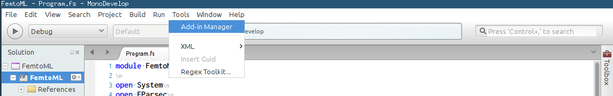
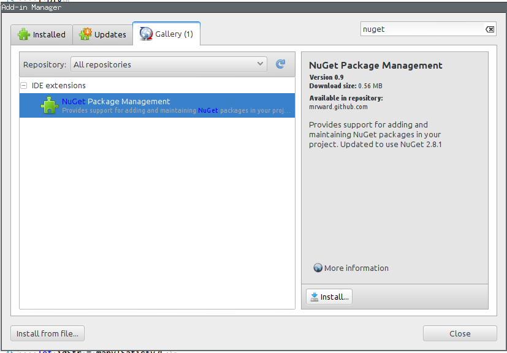
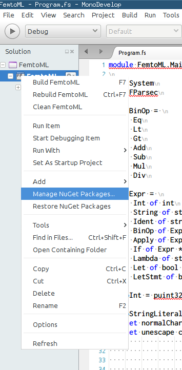
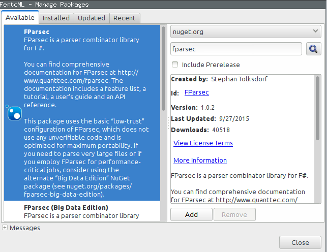

# Installation

Öffnen der Solution in MonoDevelop. Das heisst File > Open und dann
FemtoML.sln auswählen.

## Installation des NuGet-Addons (falls noch nicht installiert)

## Installation von FParsec in der Solution

Das Programm kann nun kombiliert und gestartet werden.

# Erstellen der Dokumentation

Im "Docs"-Ordner hat es zwei Markdown-Files: Tutorial.md und Presentation.md.

Um daraus das PDF erstellen zu können, wird Pandoc und Latex benötigt.

Die besten Resultate hatte ich beim Generieren auf Windows. Die Installation auf Windows
ist folgendermassen:

* Installation von Miktex (http://miktex.org/) (Komplettinstallation)
* Installation von Pandoc (https://github.com/jgm/pandoc/eleases/tag/1.17.1) Downloads
ganz unten.

Danach ein Terminal starten (das "cmd" auf Windows) und im "Docs"-Verzeichnis folgende Befehle ausführen:

* Für die Präsentation: `pandoc Presentation.md -t beamer -o Presentation.pdf`
* Für das Tutorial: `pandoc Tutorial.md --variable=geometry:a4paper -o Tutorial.pdf`

Wichtig: Auf Windows darf das PDF nicht offen sein, wenn die Befehle ausgefürt werden. Ansonsten
hat der Prozess keine Berechtigung, das File zu schreiben.
